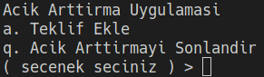
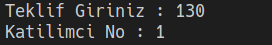
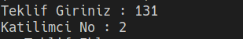
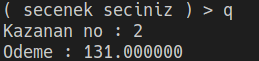

# Acik Arttirma Uygulamasi

Basit bir acik arttirma uygulamasi.

- Onunuze cikan menuden istediginiz kadar teklif ekleyebilirsiniz.
- İstediginiz zaman cikip acik arttirmayi kazanani gorebilirsiniz.

# Ekran Goruntuleri

---

---

---

---

---

# Typedef ve Struct

C dilinde typedef kullanarak yapı (struct) tanımlamak, mevcut bir veri türünü daha okunabilir ve esnek hale getirmek için yaygın olarak kullanılan bir tekniktir. Bu, genellikle karmaşık veya uzun veri türü isimlerini basitleştirmek ve kodunuzu daha anlaşılır hale getirmek için kullanılır.

typedef kelimesi, mevcut bir veri türünü farklı bir isimle yeniden adlandırmak için kullanılır. struct ise C dilinde bir yapı (structure) tanımlamak için kullanılır. Yapılar, farklı veri tiplerini tek bir veri tipi olarak gruplamak için kullanılır.

---

# Acik Arttirma ve Oyun Teorisi Iliskisi

Açık artırma ve oyun teorisi arasındaki ilişki, ekonomi ve strateji alanlarında önemli bir rol oynayan karmaşık bir etkileşimi temsil eder. Açık artırma, bir mal veya hizmetin satışının, teklif verenler arasında rekabetin olduğu bir yöntemdir. Bu süreç, bir oyun teorisi çerçevesinde incelendiğinde, katılımcıların kendi çıkarları doğrultusunda en iyi stratejileri belirlemeye çalıştıkları dinamik bir ortaya çıkar.

Oyun teorisi, çeşitli oyuncular arasındaki etkileşimleri ve bu oyuncuların karar alma süreçlerini analiz eden bir disiplindir. Açık artırmalar, bir alıcı ve bir satıcı arasındaki rekabetin bir örneğidir ve bu rekabet, oyuncuların kendi çıkarlarını optimize etmek için stratejik kararlar almalarını gerektirir. Katılımcılar, belirli bir mal veya hizmetin değerini değerlendirirken, fiyatın belirlenmesi ve tekliflerin artırılması konusunda stratejiler geliştirirler.

Açık artırmalarda, her bir teklif, bir oyuncunun diğerlerine karşı benzersiz bir stratejisini temsil eder. Oyuncular, ne kadar teklif verileceği, ne zaman teklif artırılacağı ve ne zaman çekilecekleri gibi stratejik kararlar alırlar. Bu kararlar, oyuncuların diğerlerinin davranışlarını öngörmeye çalıştığı bir stratejik düşünce sürecini içerir. Her oyuncu, kendi çıkarlarını maksimize etmeye çalışırken, diğer oyuncuların davranışlarını dikkate almalıdır.

Ayrıca, açık artırmaların oyun teorisi bağlamında incelenmesi, katılımcıların bilgi eksikliği ve risk toleransları gibi faktörleri de içerir. Oyuncular, gelecekteki teklifleri tahmin etmeye çalışırken ve belirli bir fiyat noktasında çekilmeye karar verirken, belirsizlik ve risk faktörleriyle başa çıkmak zorundadırlar.
